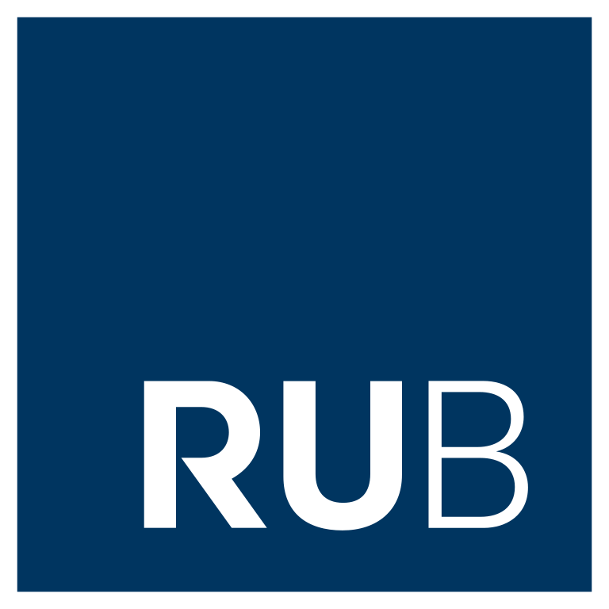

<head>
  <meta name="viewport" content="width=device-width, initial-scale=1">
  
  </head>

<h1>Welcome to the RUB WIM website!</h1>

## ABOUT US

We are an inclusive group of mathematicians based at RUB.
Our goal is to empower and support women and gender minorities in the field of mathematics. We believe in the importance of collaboration, networking and mentorship to foster an inclusive and diverse mathematical community. 

**What we aim at:**

- Encouragement: promoting and inspiring women to pursue mathematics as a field of study.
- Building collaborations: connecting like-minded individuals and establishing collaborations within the mathematics community.
- Networking: providing a space for women in mathematics to connect, share experiences and exchange ideas.
- Mentorship for established and aspiring researchers in mathematics.

  

    

  
	

	  

		

		  <a href="#">29 <small>Mar</small></a>
		  

			<h4 class="media-heading">
			  <a href="#">Building In WebCorpCo CMS 8</a>
			</h4>
			

			  Learn about all of the possibilities of web design in our latest CMS release.
			

		  

		

	  
<!-- / blogPost -->
	  

		

		  <a href="#">22 <small>Mar</small></a>
		  

			<h4 class="media-heading">
			  <a href="#">WebCorpCo Named To Inc. 5000</a>
			</h4>
			

			  Inc. magazine today ranked WebCorpCo as the 1,870th fastest growing company on the 34th annual Inc. 5000.
			

		  

		

	  
<!-- / blogPost -->
	
<!-- / slide1 -->
	
	

	  

		

		  <a href="#">12 <small>Mar</small></a>
		  

			<h4 class="media-heading">
			  <a href="#">7 Critical Factors When Choosing A CMS</a>
			</h4>
			

			  Finding a solution that can be tailored to support the needs of your business is more important than ever.
			

		  

		

	  
<!-- / blogPost -->
	  

		

		  <a href="#">10 <small>Mar</small></a>
		  

			<h4 class="media-heading">
			  <a href="#">What Is A Content Management System</a>
			</h4>
			

			  So many acronyms that most of us know a brief amount about, if at all, let alone the meaning of those three little letters we hear so often.
			

		  

		

	  
<!-- / blogPost -->
	
<!-- / slide2 -->

    

  
	

	

		

			<a href="#" class="link-underline">See All News</a>
		

		

			<button id="ct-js-district-calendar--prev" type="button" class="slick-arrow next"></button>
			<button id="ct-js-district-calendar--next" type="button" class="slick-arrow next"></button>
		

	

										

## JOIN US

Sign up for our [mailing list](https://lists.ruhr-uni-bochum.de/mailman/listinfo/women-in-maths) 
<!-- End Jekyll SEO tag or become a member by filling out [this Google form](https://docs.google.com/forms/d/e/1FAIpQLSdmaadCNGYQ25b-C8ToJdVUVEInu_W2b99f71fXeSLqNCN-1Q/viewform?usp=sf_link)-->

[Fakultät für Mathematik](https://math.ruhr-uni-bochum.de/) at the Ruhr-Universität Bochum webpage
